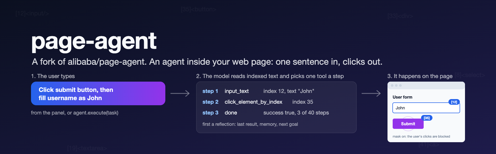
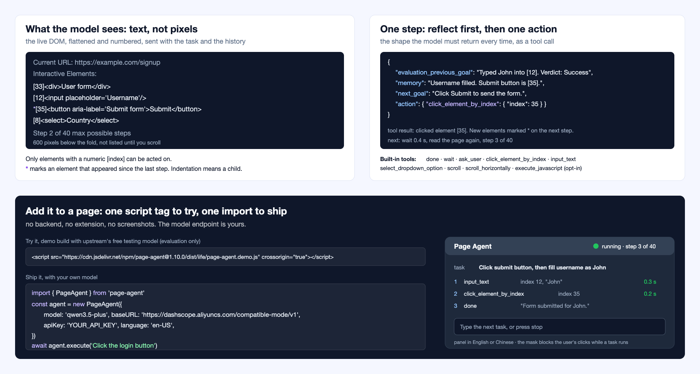
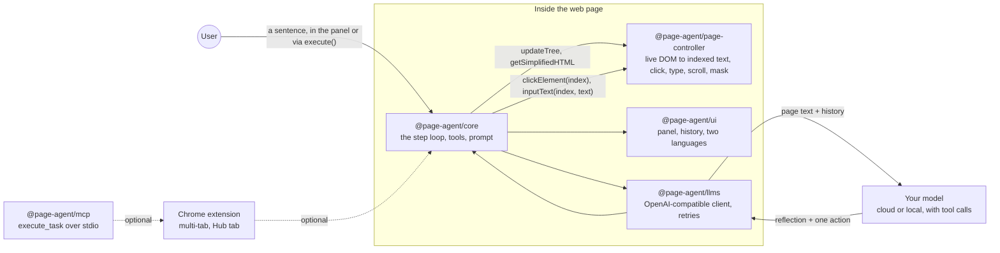

<div align="center">



<br>

**An agent that lives inside your web page. One sentence in, clicks, typing and scrolling out,<br>on the page the user already has open. No screenshots, no backend, no browser extension needed.**

<br>

> **This is a fork of [alibaba/page-agent](https://github.com/alibaba/page-agent).** The library, the extension, the docs and the ideas are theirs. This fork has **no commits of its own** and sits 76 commits behind upstream. Use upstream for anything real; see [How far to trust it](#how-far-to-trust-it).

<br>

[](https://www.typescriptlang.org)
[](https://www.npmjs.com/package/page-agent)
[](https://vite.dev)
[](#how-it-works)
[](https://chromewebstore.google.com/detail/page-agent-ext/akldabonmimlicnjlflnapfeklbfemhj)
[](https://alibaba.github.io/page-agent/docs/features/mcp-server)
<br>
[](#how-far-to-trust-it)
[](https://github.com/alibaba/page-agent)
[](#licence)

[What it does](#what-it-does) · [The rules it keeps](#the-rules-it-keeps) · [How far to trust it](#how-far-to-trust-it) · [How it works](#how-it-works) · [Run it yourself](#run-it-on-your-machine) · [Upstream docs](https://alibaba.github.io/page-agent/docs/introduction/overview)

</div>

<br>

<p align="center">
  
</p>

## Why page-agent

Most browser agents sit outside the page. They drive a headless browser or an extension, take screenshots, and need a multimodal model to read them. That is the right shape for scraping, and the wrong shape for a product.

page-agent, made by Simon and the team at Alibaba, turns this around. It is a JavaScript library you add to your own site. It reads the live DOM, boils it down to a short text list of interactive elements, sends that to a language model you choose, and carries out the action the model picks: click this index, type into that one, pick a dropdown option, scroll. The user watches it happen on the page they already have open, behind a mask that blocks their clicks while the agent works. A support bot can stop saying "click Settings, then Billing" and just do it.

This repository is a personal fork of that work, kept for reading and experiment. Nothing in it has been changed.

## What it does

| | |
|---|---|
| **One line to try it** | A `<script>` tag loads the demo build, which comes with a floating panel and a free testing model. For evaluation only; the model runs on Alibaba Cloud in China and is not for production. |
| **One import to ship it** | `npm install page-agent`, then `new PageAgent({ model, baseURL, apiKey })` and `agent.execute('Click the login button')`. |
| **Reads text, not pixels** | The page is flattened to lines like `[35]<button aria-label='Submit form'>Submit</button>`. Only elements with an index can be acted on. New elements since the last step are marked with `*`. |
| **Nine built-in tools** | `done`, `wait`, `ask_user`, `click_element_by_index`, `input_text`, `select_dropdown_option`, `scroll`, `scroll_horizontally`, and `execute_javascript`, which is off unless you switch it on. |
| **Thinks before each move** | Every step the model must write an evaluation of the last step, a memory note and the next goal before it names an action. Steps are capped at 40 by default, with 0.4 seconds between them. |
| **Your model, your rules** | Any OpenAI-compatible endpoint with tool calls, including Ollama and LM Studio on your own machine. Add system instructions, per-URL page instructions, custom tools, or remove a built-in tool by name. |
| **Hooks for your app** | `transformPageContent` to mask data before it leaves the browser, `transformRequestBody` for prompt-caching headers, `customFetch` to go through your own proxy with cookies, and lifecycle hooks before and after each step and task. |
| **Two languages in the panel** | The built-in panel speaks English and Chinese. |
| **Optional Chrome extension** | For tasks that cross tabs. Pages and local agents talk to it through `window.PAGE_AGENT_EXT` after the user shares a token from the side panel. |
| **MCP server, beta** | `npx -y @page-agent/mcp` exposes `execute_task`, `get_status` and `stop_task` so a desktop agent such as Claude Desktop can drive the extension. |

## The rules it keeps

These are upstream's rules, as written in the prompt, the types and the docs:

- **Text only.** No screenshots, no multimodal model. Images, canvas, WebGL and SVG are invisible to it. Good semantic HTML makes it work better; visual-only cues make it fail.
- **One page at a time.** The core library does not leave the current page and will not click a link that opens a new tab. Multi-page work is the extension's job.
- **Bring your own key, and keep it out of the page.** The library has no backend. For a real product, put the model behind your own proxy and use `customFetch` to send cookies.
- **It is allowed to fail.** The prompt tells the model that trying too hard is harmful, that it must report a broken page, and that it must ask the user when it lacks information. A captcha stops it.
- **JavaScript execution is opt-in.** `experimentalScriptExecutionTool` is off by default, because it can bypass the allowlist and data masking. It is disabled outright in the multi-page agent.
- **Errors stay visible.** The maintainers' instruction to contributors: do not hide errors or risks; traceability matters more than success rate.

## How far to trust it

> [!IMPORTANT]
> **This fork is not maintained and has no changes of its own.** Its `main` is upstream's `main` as of 26 June 2026, version 1.10.0. Upstream has since moved to 1.12.4 (6 September 2026), 76 commits ahead, including fixes to the LLM client, the extension's tab controller and the DOM tree. If you want page-agent, install `page-agent` from npm or clone [alibaba/page-agent](https://github.com/alibaba/page-agent). Do not build on this copy.

What upstream itself says about limits, as of 1.10.0:

- **Supported:** click, text input, select, vertical and horizontal scroll, form submit and focus, a single level of same-origin iframe, and JavaScript if enabled.
- **Not supported:** hover, drag and drop, right-click, keyboard shortcuts, position-based control, nested or cross-origin iframes, drawing, and editors such as Monaco or CodeMirror that need their JavaScript instance.
- **Models:** it needs tool calls. Models under about 10B parameters are usually not strong enough, and a local model needs a context window of at least 8,000 tokens because a typical page costs around 15,000. Upstream's tested list and its recommended light models are on the [models page](https://alibaba.github.io/page-agent/docs/features/models).
- **The free demo model** is for technical evaluation only, may be rate-limited or switched off at any time, processes data in mainland China, and must not see personal data. Read [`docs/terms-and-privacy.md`](docs/terms-and-privacy.md) before using it.
- **Tests** cover the LLM client, the page controller and the core loop with unit tests only. There are no end-to-end tests yet.

## How it works



Each step: the controller walks the DOM, keeps only what is interactive or visible, and numbers it. The core wraps that text with the task, the history and the step count, and asks the model for one tool call. The model must first fill in its reflection, then the action. The core runs the action through the controller, records the step, waits `stepDelay`, and goes again until the model calls `done` or `maxSteps` runs out.

| Package | What it is |
|---|---|
| [`page-agent`](packages/page-agent) | The thing you install. `PageAgent` extends the core and adds the panel and the mask |
| [`@page-agent/core`](packages/core) | `PageAgentCore`: the loop, the nine tools, the system prompt, hooks, custom tools, instructions |
| [`@page-agent/page-controller`](packages/page-controller) | DOM extraction (derived from browser-use), element actions, the `SimulatorMask` overlay. No model inside |
| [`@page-agent/llms`](packages/llms) | The OpenAI-compatible client, tool-call shaping, two retries, temperature 0.7 |
| [`@page-agent/ui`](packages/ui) | The floating panel, history list and i18n, decoupled through an adapter interface |
| [`@page-agent/ext`](packages/extension) | The Chrome extension, built with WXT and React, with the multi-page agent and the Hub |
| [`@page-agent/mcp`](packages/mcp) | The MCP server. Plain JavaScript, no build step, port 38401 by default |
| [`@page-agent/website`](packages/website) | Upstream's docs site and live demo |

## Run it on your machine

To use the library you need any page and a model endpoint. To work on the repository you need Node.js 22.22 or newer (or 24), and npm 11.6 or newer.

**Try it on a page** with the demo build, which uses upstream's free testing model:

```html
<script src="https://cdn.jsdelivr.net/npm/page-agent@1.10.0/dist/iife/page-agent.demo.js" crossorigin="true"></script>
```

The China mirror is `https://registry.npmmirror.com/page-agent/1.10.0/files/dist/iife/page-agent.demo.js`. Add `?autoInit=false` to load the script without creating the demo agent, then make your own with `new window.PageAgent(...)`. By using the demo model you accept its [terms](docs/terms-and-privacy.md).

**Use it in your own app:**

```bash
npm install page-agent
```

```javascript
import { PageAgent } from 'page-agent'

const agent = new PageAgent({
    model: 'qwen3.5-plus',
    baseURL: 'https://dashscope.aliyuncs.com/compatible-mode/v1',
    apiKey: 'YOUR_API_KEY',
    language: 'en-US',
})

await agent.execute('Click the login button')
```

Never put a real API key in frontend code. For a product, point `baseURL` at your own proxy and pass `customFetch` so the request carries the user's cookies.

**Work on the repository:**

```bash
git clone https://github.com/vishalmeena2211/page-agent.git && cd page-agent
```

```bash
npm i
```

```bash
npm start
```

That serves the docs site and playground. To use your own model there, create a `.env` in the repo root with `LLM_MODEL_NAME`, `LLM_API_KEY` and `LLM_BASE_URL`, then restart the dev server. Without it, the playground uses the free testing model.

```bash
npm run dev:demo
```

That serves the demo bundle at `http://localhost:5174/page-agent.demo.js` for trying the agent on other sites through a bookmarklet, as described in [`docs/developer-guide.md`](docs/developer-guide.md). A key in your `.env` is inlined into that bundle, so do not share it.

```bash
npm run build && npm run typecheck && npm test && npm run lint
```

`npm run dev:ext` and `npm run build:ext` are for the extension.

## Repository layout

| Folder | What is in it |
|---|---|
| [`packages/`](packages) | The eight workspaces listed above, in topological order. Library exports point at `src/` while developing and at `dist/` when published |
| [`scripts/`](scripts) | Build, CI, version sync and the pre- and post-publish scripts that swap the export paths |
| [`docs/`](docs) | [Developer guide](docs/developer-guide.md), [changelog](docs/CHANGELOG.md), [terms for the testing model](docs/terms-and-privacy.md), the Chinese README |
| [`AGENTS.md`](AGENTS.md) | Upstream's instructions for coding assistants: module boundaries, how to add a tool, test layout |
| [`.github/`](.github) | Upstream's CI, release and demo-deploy workflows, Dependabot, issue and PR templates |

## Roadmap

This fork has no roadmap of its own. Upstream's is in its [changelog](docs/CHANGELOG.md) and issues.

- [x] Forked at 1.10.0
- [ ] Pull upstream `main` (1.12.4 or later) into this fork
- [ ] Decide what this fork is for, and either say so here or archive it

## Contributing

Please contribute upstream, at [alibaba/page-agent](https://github.com/alibaba/page-agent), where the maintainers are. Read their [`CONTRIBUTING.md`](CONTRIBUTING.md) and the [maintainer's note](https://github.com/alibaba/page-agent/issues/349) first. They do not accept pull requests written entirely by bots or AI, and they do not allow vibe coding in the core library or the extension.

If you open an issue on this fork, expect it to be pointed upstream.

## Credits

Everything here is other people's work:

- **page-agent** by [Simon](https://github.com/gaomeng1900) and the contributors to [alibaba/page-agent](https://github.com/alibaba/page-agent), copyright 2026 SimonLuvRamen and Alibaba Group Holding Limited.
- **DOM processing and the system prompt** derive from [browser-use](https://github.com/browser-use/browser-use), copyright 2024 Gregor Zunic, MIT licence.
- **The free testing model** is paid for by upstream's maintainers on Alibaba Cloud. The project is not an Alibaba Cloud product.

## Licence

**[MIT](LICENSE)**, copyright 2026 SimonLuvRamen and Alibaba Group Holding Limited. The licence file is upstream's, unchanged. Use it, change it and share it, keeping the copyright notice.

## Words used here

| Word | What it means |
|---|---|
| **GUI agent** | A program that reads a user interface and acts on it for you |
| **Dehydration** | Boiling the live DOM down to a short, indexed text list the model can read |
| **Index** | The number in `[35]` that the model uses to name an element. Only indexed elements can be acted on |
| **Step** | One round: page text in, reflection and one action out, action carried out. Capped at `maxSteps`, 40 by default |
| **Reflection before action** | The rule that every step must state an evaluation, a memory note and a next goal before its action |
| **Mask** | The overlay that blocks the user's clicks while the agent works, and shows where it is clicking |
| **BYOK** | Bring your own key. The library has no backend; the model endpoint is yours |
| **Ext** | The Chrome extension, Page Agent Ext, which adds multi-tab control |
| **Hub** | The extension's tab that receives tasks from outside the browser, for example from the MCP server |

<br>

<div align="center">
<sub>A fork, kept for reading. The work is alibaba/page-agent's; go there for the real thing.</sub>
</div>
